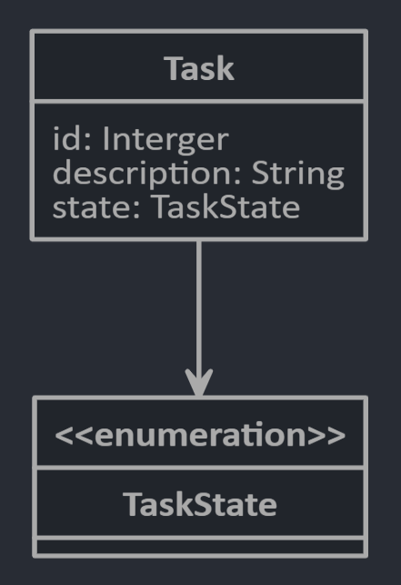

# ESTÁGIO EM TI - DESENVOLVIMENTO WEB (13031)
  
Av Robert Bosch, Campinas, SP, Brasil - Intern

## Implementação do Backend
O teste que propusemos para o explorar os seus conhecimentos de Backend têm como objetivo a implementação de uma API REST para lidar com as tarefas em sua aplicação de lista de tarefas.

Idealmente você deverá realizar a implementação seguindo o paradigma de orientação a objetos, deste modo você terá uma classe que representará as tarefas.

A imagem a seguir apresenta o modelo de dados que você deverá representar por meio de classes, a classe tarefa têm como atributos um campo de identificação (Inteiro ou UUID), um campo de descrição (String) e uma enumeração que deverá conter o seguintes elementos identificadores:
- OPEN
- DONE

Você deverá implementar com a linguagem de sua escolha (Python, Java, Javascript) e framework (Flask, Spring, Express) uma API REST.

Os métodos necessários para esta API são os seguintes:
- **GET** `List<Task> listTasks()`: este método deverá listar todas as tarefas existêntes no banco de dados;
- **GET** `Task getTask(Integer taskId)`: este método deverá retornar os dados de uma tarefa específica existente no banco de dados;
- **POST**  `createTask(Task task)`: este método é responsável por criar uma nova tarefa no banco de dados;
- **PUT**  `editTask(Integer taskId, Task task)`: este método é responsável por atualizar o conteúdode uma tarefa específica no banco de dados;
- **DELETE**  `deleteTask(Integer taskId)`: este método é responsável remover uma tarefa do banco de dados por meio de seu número de identificação;

## Bônus (opcional) :star2:
Você pode como um bônus adicionar algum método de documentação da sua API (Swagger Ui, Flask API Spec)

## Critérios de avaliação
Nossa análise vai além do resultado final então se você tiver um problema implementando algum detalhe nos envie a sua solução mesmo assim.
- Capacidade em assimilar um conteúdo novo
- Organização
- Atenção aos requisitos
- Empenho em entregar algo, mesmo que minimamente funcional
- Tratamento de erros

# Boa sorte! :punch:
